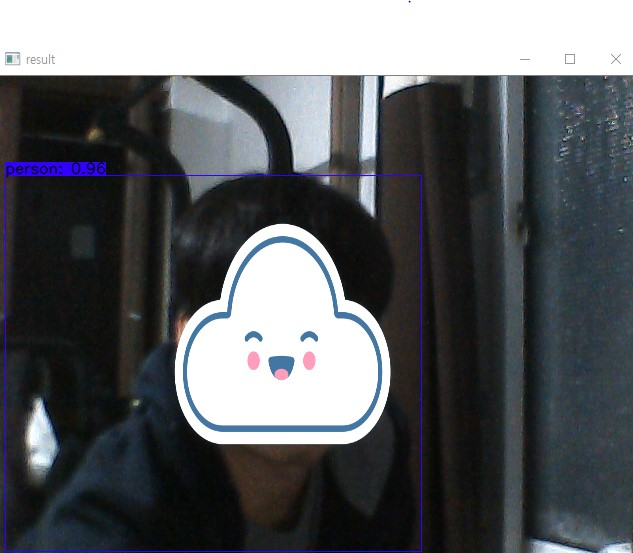

# tensorflow-yolov4_object_detection

### 사전절차 
* Tensorflow 2.3.0rc0 설치

### 1. 사전 학습된 yolo_v4가중치 다운받기.<br>
 https://drive.google.com/open?id=1cewMfusmPjYWbrnuJRuKhPMwRe_b9PaT

### 2. 다운받은 가중치를 data 폴더안으로 집어넣기.
<br>

### 3. 다크넷 가중치 tensorflow로 변경

```bash
python save_model.py --weights ./data/yolov4.weights --output ./checkpoints/yolov4-416 --input_size 416 --model yolov4 

```

### 4.ip주소와 port 번호 설성
<br>

### 5.실행
```bash
python detect_video_simple.py 
```


## 기존 yolo_v4 object detection 프로그램에서의 차이점
### 1. 서버와의 TCP 소켓 통신 추가
### 2. 사람이 검출될시 조건을 삽입하여 통신하게끔 수정
### 3. 검출 영역조정
### 4. 실시간 영상에서 검출 영역만 뽑아서 사진으로 저장
#### Output

<p align="center"></p>
