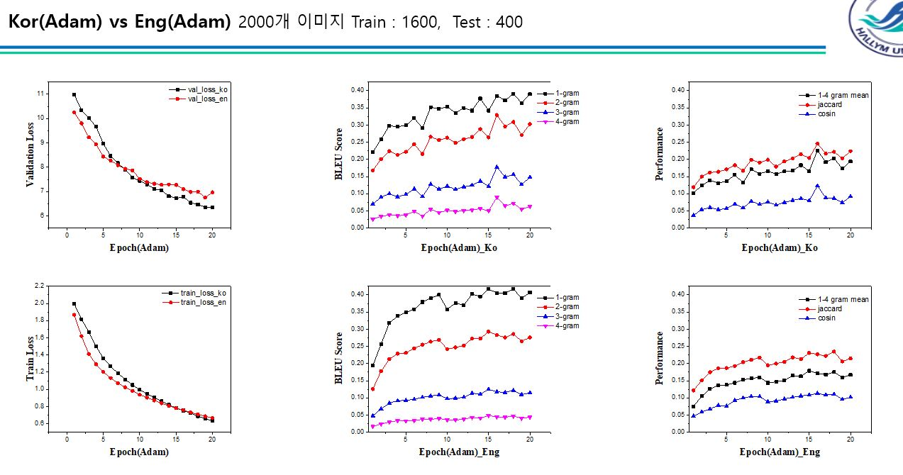

# tensorflow-image_captioning

### 사전절차 
* Tensorflow gpu 설치

## 훈련 

### 1. train.ipynb 실행<br> 


## server 실행

### 사전절차
* 사실 본인의 docker를 통한 gpu tensorflow서버에서 돌려놓은 모델의 checkpoint를 삽입 하려 했으나
  gpu의 성능이 너무낮아 <br> 충분한 학습이 이루어지지않았다. 하지만 데이터 학습과정에서 epoch에 따른 val_loss가 감소하는것을 확인하였으니 사용자가 만족할만큼의 학습을 진행한후 저장된 checkpoint를 사용할것.


### 1. cool-sms가입 & 설치
* open API로 최초가입시 15통까지의 문자를 공짜로 사용할수있음
<br>https://coolsms.co.kr/
```bash
 !pip install coolsms_python_sdk
```

### 2.naver 파파고 API 받기 & 설정
<br>

### 3.ip주소와 port 번호 설성
```bash
HOST = 'SERVER_IP' <- 각자 설정한 server의 IP번호
PORT = 'SERVER_PORT' <- 각자 설정한 server의 Port번호
```
<br>

### 4.실행
```bash
python TCP_SERVER.py
```

### 5. 서버에서 자동 실행을 원한다면
```bash
systemctl service를 이용한 자동 부팅 실행 적용할것.
```
## 평가지표 와 성능 비교
### 옵티마이저 선택
<p align="center"></p>

#### 학습진행상태가 진행됨에따가 loss의 곡선이 완만해지고있으며
#### 가장 val_loss와 train_loss의 차이가 적은것은 Nadam인것을 확인할수있다.

### 옵티마이저 성능
<p align="center"></p>
<p align="center"></p>

#### loss가 떨어지는만큼 평가지표의 점수또한 올라가는것을 확인할수있다.

### 한국어와 영어의 차이
<p align="center"></p>

#### 해당 부분에대해 할말이 많은데 일단
#### 한국어의 tonkenizer 부분을 잘못설정하여 제대로된 단어보다 unk태그가 붙은 단어가 훨씬 많이 추출되었다
#### 그이유는 한국어 형태소 분석 모듈을 사용했어야했는데 실수로 영어 형태소 분석을 사용하여 
#### 원래대로라면 "사과를 먹다." 를 "사과", "를", "먹다" 로 해야하는것이 옳지만 현재는 "사과를","먹다"로 되어있다.
#### 이로인해 "사과를","사과에","사과와","사과도" 들이 각각 다른 단어로 인식되어 사전의 개수를 제한해놓은 현재 모델에서
#### 많은 단어들이 unk태그가 붙어버렸다. 즉 현재  kor와 eng의 성능비교는 잘못되어있다.

### 현재까지 학습의 성능
<p align="center"></p>

#### 현재까지도 지속적으로 loss값이 감소되는 모습을 확인중이며 이를 통해 성능이 개선되는중이란것을 알수있었다.


# 중요 사항
### 1. 문장 정확도 비교를 위한 다양한 문장 유사도 평가함수 적용
### 2. 12만여개의 이미지 60여개의 캡셔닝 문장을 데이터로 사용
### 3. val loss와 train loss의 확인을 위한 csv 저장
### 4. 핸드폰으로 sms 전송
### 5. 만들어진 문장 자동 번역
### 6. 문장에 나타난 단어에 따른 위험 안내 서비스
### 소스코드의 자세한 내용은 train.ipynb를 참조할것

# TEST EXAMPLE
<br>
<p align="center"></p>

<br>
<p align="center"></p>
<br>
<p align="center"></p>
<br>
